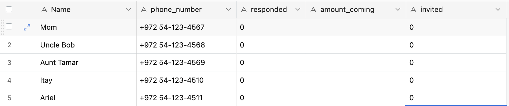
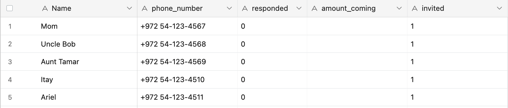
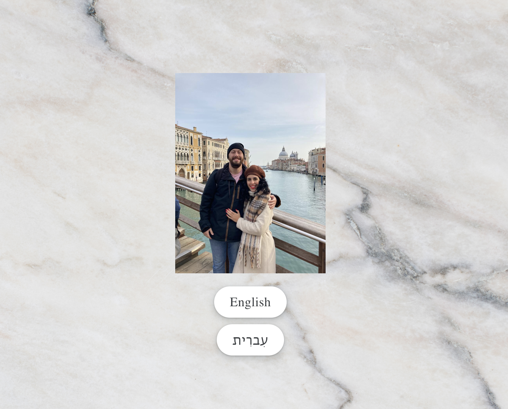
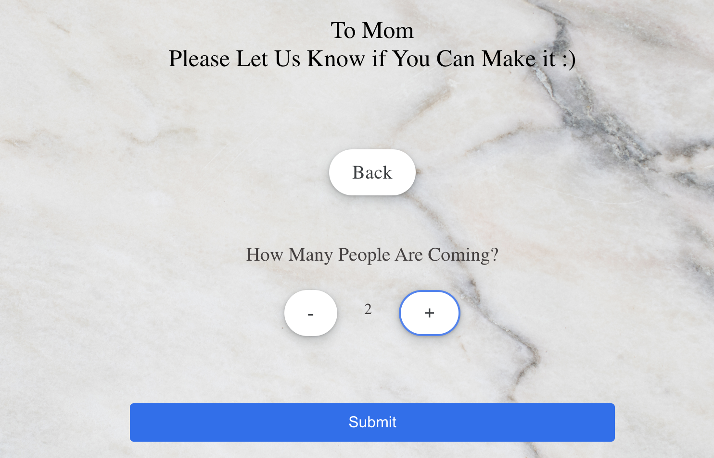

## Summary
This project contains a full stack website and invitation sender function for my wedding. The backend is compiled in node.js and the frontend in react. The invitation sender is 
constructed using Twilio whatsapp senders. All of the data is pulled and updated via an Airtable table. 

## Running the Code
To Run the code, nagivate into the client and run __npm start__ ; navigate into the server and run __python main.py__

## Airtable
Airtable Base is constructed with 5 Columns: Name, phone_number, responded, amount_coming, invited.
Populate the first 2 columns, Name and phone_number, with guests to invite. 

The other columns will be autopopulated when the code is executed and when invitess respond.

## Send Invitations Via Whatsapp
send_message.py sends invitations via twilio to all of your guests whatsapp numbers who do not have column invited ==1 . Each invitation includes a link for the guest to rsvp. After
the invitation is sent to a guest, the invited column is populated with 1. 

Each recipient is sent a customized rsvp link. The code of the rsvp site is in the client/server folders 

## RSVP
As we had a mixed Israeli/American Wedding, the homepage prompts the guest to select a language:

 
 
Next the User is asked if they are coming, not coming, or unsure:

 
 
If the guest selects "will attend", the guest is then directed to input the amount of guests in their party:

 
 
After pressing submit, "will not attend" or "Not sure yet", the guest is directed to the final page where they're notified that their response was recorded

 
 
Note that the airtable is automatically updated with the guests response in the form. For each guest that responds, the 'responded' column becomes 1, and 'amount coming' becomes either 0 (Will not attend), does not change (Not Sure Yet) or the amount of guests input (Will attend).

The link that is contained in the invitation directs the guest to the rsvp site seen in the server/client folders. The site is hosted on Heroku. 
