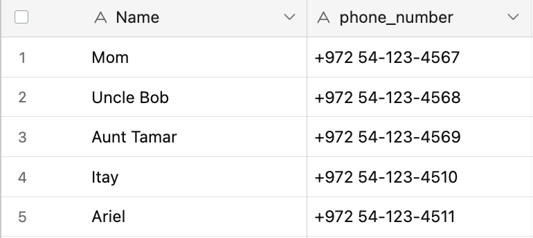

## Summary
This project contains a full stack website and invitation sender function for my wedding. The backend is compiled in node.js and the frontend in react. The invitation sender is 
constructed using Twilio whatsapp senders. All of the data is pulled and updated via an Airtable table. 

## Running the Code
To Run the code, nagivate into the client and run __npm start__ ; navigate into the server and run __python main.py__

## Airtable
Airtable Base is constructed with 5 Columns: Name, phone_number, responded, amount_coming, invited.
Populate the first 2 columns, Name and phone_number, with guests to invite. 

## Send Invitations Via Whatsapp
send_message.py sends invitations via twilio to all of your guests whatsapp numbers who do not have column invited ==1 . Each invitation includes a link for the guest to rsvp. After
the invitation is sent to a guest, the invited column is populated with 1. 

The link that is contained in the invitation directs the guest to the rsvp site seen in the server/client folders. The site is hosted on Heroku.
